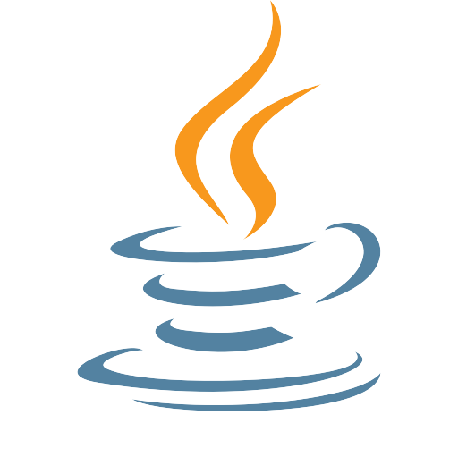
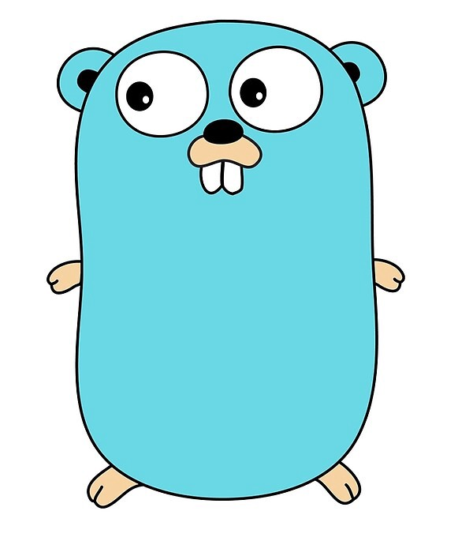
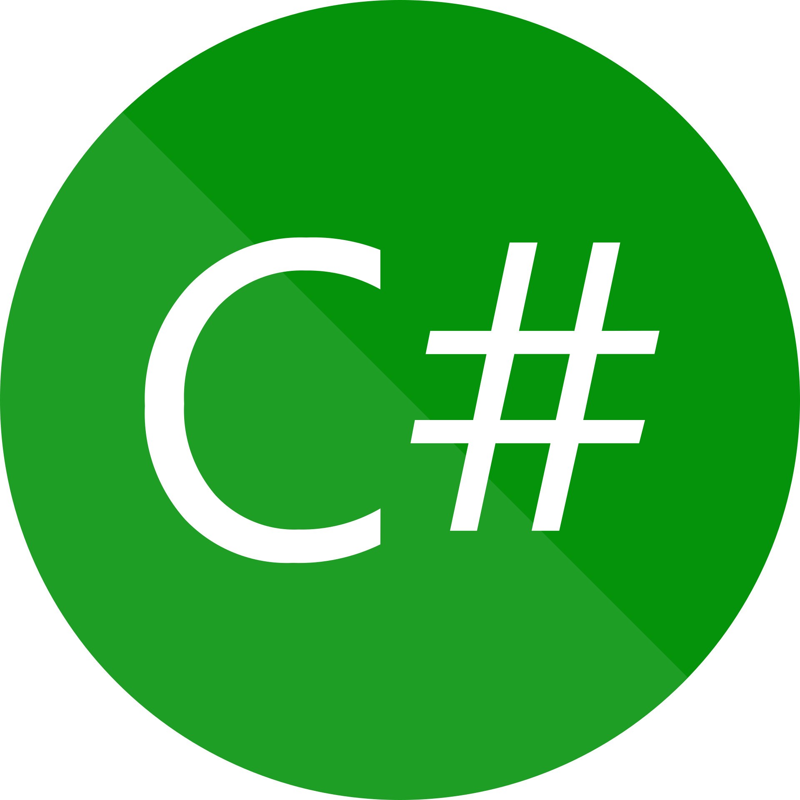
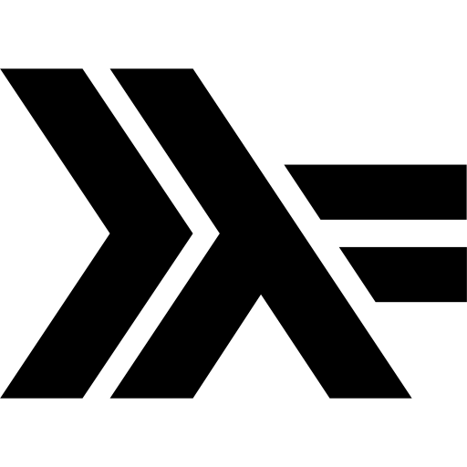
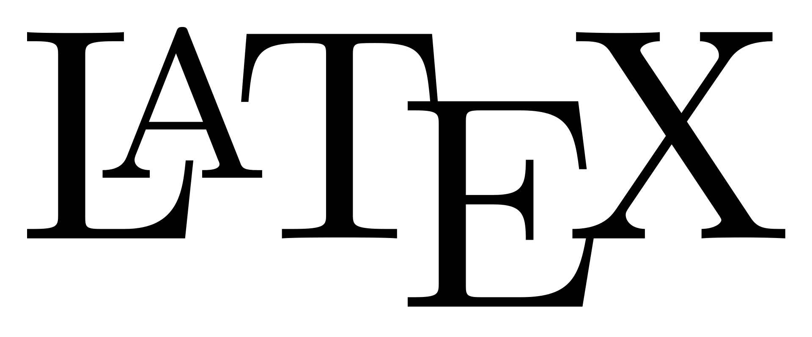

### My name is Niklas, and I am a
* M.Sc. Student - Computer Science, [KTH Royal Institute of Technology.](https://www.kth.se/) 
* Teaching assistant in the course [DD1396 Parallel and Concurrent Programming](https://www.kth.se/social/course/DD1396/)

### Some of my achievements
* :3rd_place_medal: 3rd place at [Scania Student Challenge 2020](https://thechallenge.scania.com/) 
* :mortar_board: Bachelor thesis [Threat modeling of large-scale computer systems: Implementing and evaluating threat modeling at Company X](http://urn.kb.se/resolve?urn=urn:nbn:se:kth:diva-280099) 

### Some of my projects
* :busts_in_silhouette: [2DMPGame](https://github.com/nwessman/2DMPGame), a two player online game written in C# and Go. 

### Skills
     

<!--
**nwessman/nwessman** is a ✨ _special_ ✨ repository because its `README.md` (this file) appears on your GitHub profile.

Here are some ideas to get you started:

- 🔭 I’m currently working on ...
- 🌱 I’m currently learning ...
- 👯 I’m looking to collaborate on ...
- 🤔 I’m looking for help with ...
- 💬 Ask me about ...
- 📫 How to reach me: ...
- 😄 Pronouns: ...
- ⚡ Fun fact: ...
- :monkey:
-->
